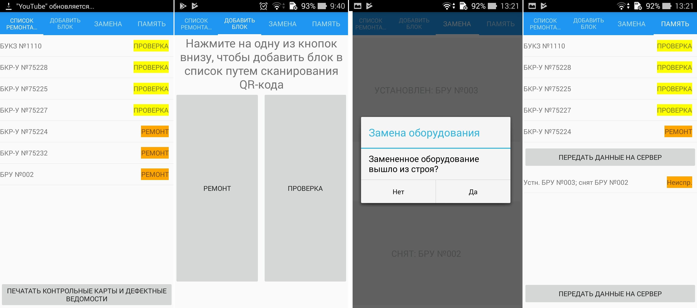

# kipapp
Проект "Информационная система цеха", мобильное кроссплатформенное приложение. Visual Studio, C#, .Net Core, Xamarin.Forms, Zxing. Используется совместно с основным приложением - https://github.com/savalik/kip

Приложение сканирует QR-коды оборудования и в зависимости от выбора пользователя создает события проверки/ремонта/замены оборудования. Информация о данных событиях передается по сети основному приложению, которое вносит изменения в базу данных и печатает необходимую документацию.

